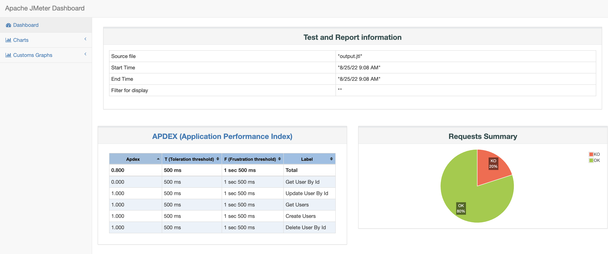
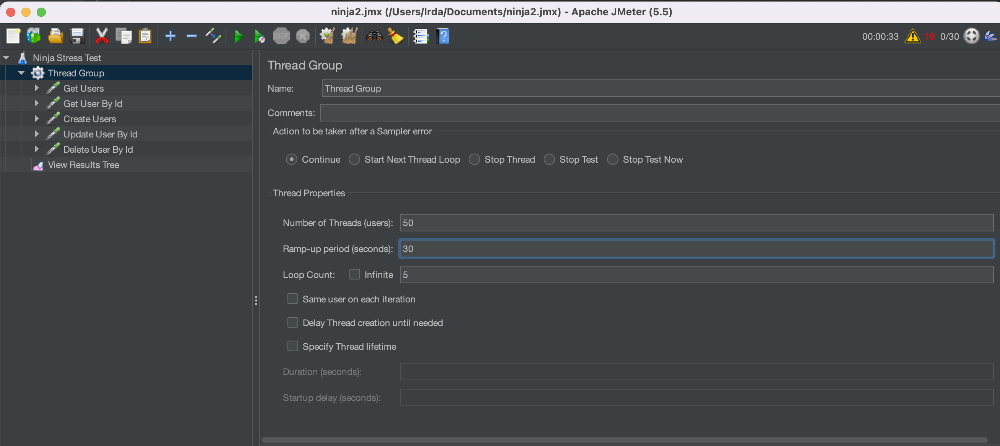
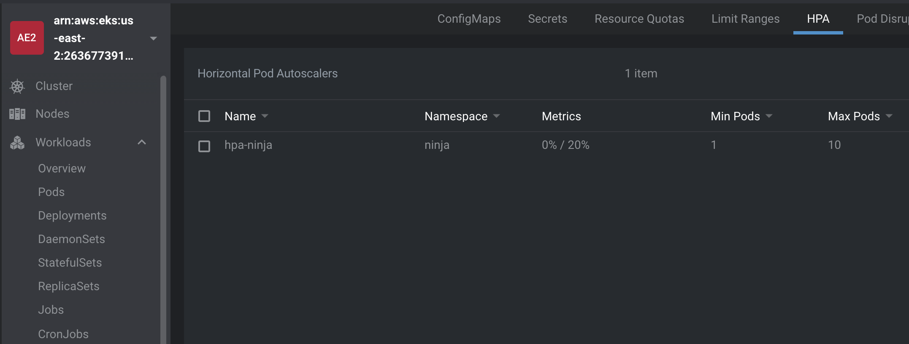
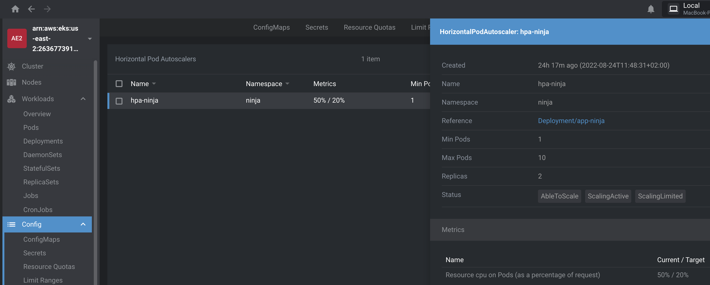
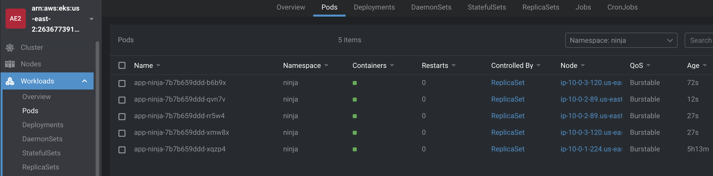

# The testing

## Unit testing
- In the ControllerTest there are the main unit tests of all the controllers of the JAVA APP

## Integration testing
- We are using the postman collection to run an integration test with a little nodejs server on the gitlab pipeline

## Load Testing
- In the load-testing directory has been a release of the load testing that we are run in the gitlab pipeline
  

- CHECKOUT THIS: A load balance testing with high threads:
  

- Before the test the HPA controls only 1 pod on the deployment:
  

- During the test the HPA have this behavior:
  

- After the test the deployment have now more replicas:
  

  
